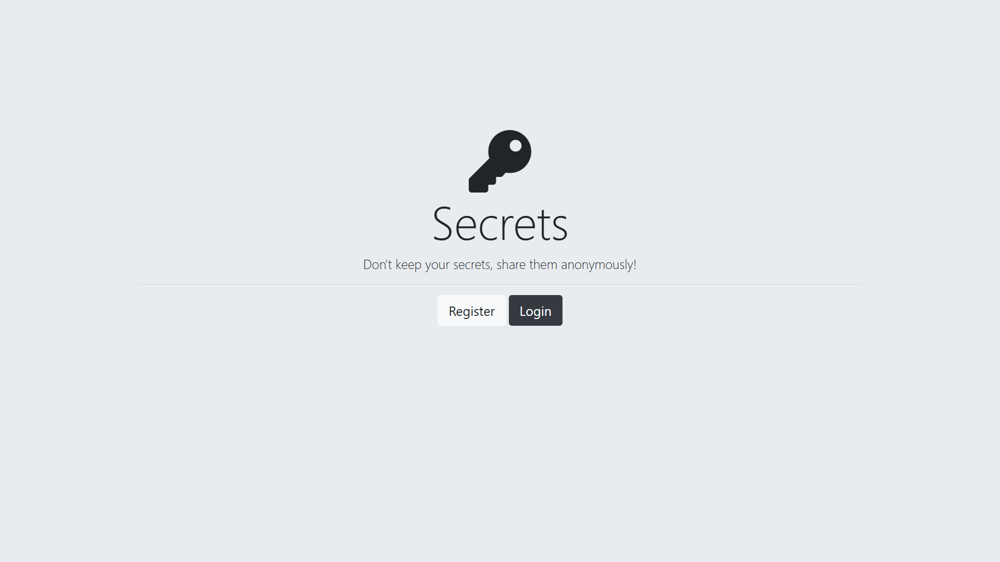
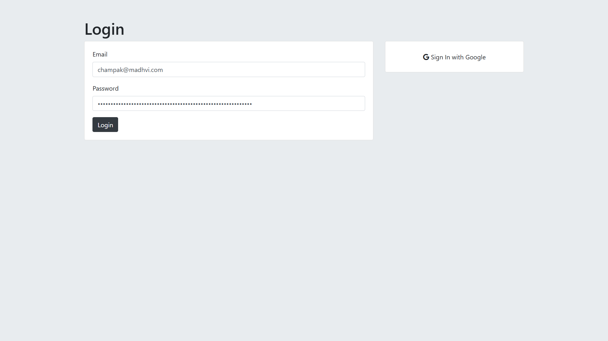

# 🔐 Secrets Web App  

## 📌 Overview  
A **secure authentication-based web application** where users can **sign up, log in, and share secrets anonymously**. Built with **Node.js, Express, PostgreSQL, and Passport.js**, this app ensures **secure user authentication** using **bcrypt, OAuth, and cookies**.  


## 🖼 Screenshot  
  
  

## 🚀 Features  
- 🔑 **User authentication using bcrypt & Passport.js**  
- 📧 **OAuth integration (Google Login, Facebook Login, etc.)**  
- 🔒 **Secure session-based login with PostgreSQL**  
- 📝 **Users can submit secrets anonymously**  
- 👀 **View secrets shared by others**  

## 🛠 Installation  

### **1️⃣ Clone the Repository**  
```bash
git clone <repo-url>
cd <repo-folder>
